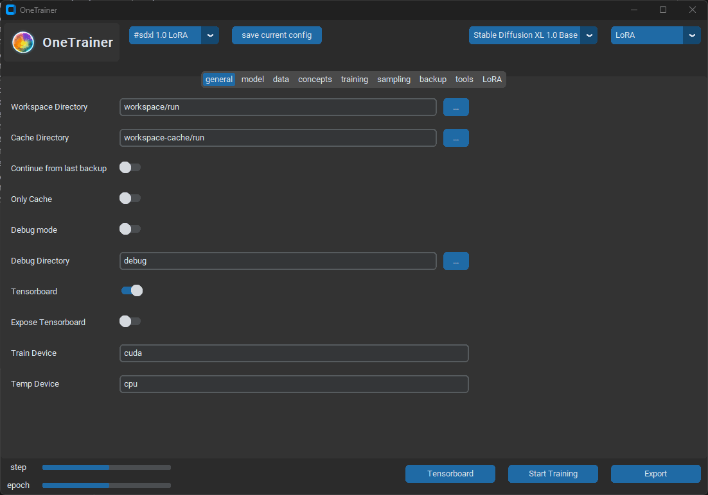

# OneTrainer

OneTrainer is a one-stop solution for all your Diffusion training needs.

<a href="https://discord.gg/KwgcQd5scF"></a><br>

## LS-OneTrainer 的修改

這是 [Nerogar/OneTrainer](https://github.com/Nerogar/OneTrainer) 的分支，增加了以下功能：

-   **繁體中文介面**：介面預設為繁體中文，可在頂部列的語言選單切換回 English（重新啟動後生效）。
    翻譯檔在 `resources/i18n/zh_TW.json`，上游更新後可執行 `python scripts/i18n_extract.py` 找出新的未翻譯字串。
-   **簡易訓練介面**：雙擊 `start-ui-simple.bat`（或執行 `python scripts/train_ui_simple.py`）。
    一頁完成設定：選模型與訓練類型、圖片資料夾、輸出名稱，其餘參數沿用 `training_presets/` 的官方 preset。
    -   顯示圖片數量、缺少 .txt 描述的圖片，以及描述檔存在卻沒被使用的警告
    -   顯示預估總步數（LoRA 通常需要 1000-3000 步）
    -   可選的預覽提示詞，每 N 輪產生預覽圖；每 N 輪儲存一份中途結果
    -   「進階模式...」可把設定帶到完整介面繼續調整；「還原預設」可重設整頁
    -   捲動頁面時不會誤改下拉選單與數字欄位
-   **Anima LoRA 預設值改為官方建議**（僅簡易介面）：Rank 32、Alpha 32、學習率 2e-5，
    依 [Anima 模型頁](https://huggingface.co/circlestone-labs/Anima)的建議。內建 preset（3e-5、Rank 16、Alpha 1）實際強度約低 10 倍。
-   **可訓練 ComfyUI 的微調模型**：在簡易介面的「自訂模型檔」填入單一 `.safetensors`／`.gguf` 檔
    （例如 ComfyUI `models/diffusion_models` 中的 Anima 微調模型），基礎模型保留官方 Diffusers 版本。
    Anima 載入器現在支援 ComfyUI 的權重命名，並會一併載入檔案中的 LLM adapter。
-   **顯示模型下載進度**：第一次使用 Hugging Face 上的模型時，狀態列與進度條會顯示下載進度。

## Features

-   **Supported models**: Ernie Image, Z-Image, Qwen Image, FLUX.1, Flux.2 Dev and Klein, Chroma, Stable Diffusion 1.5, 2.0, 2.1, 3.0, 3.5, SDXL, Würstchen-v2, Stable Cascade,
    PixArt-Alpha, PixArt-Sigma, Sana, Hunyuan Video and inpainting models
-   **Model formats**: diffusers and ckpt models
-   **Training methods**: Full fine-tuning, LoRA, embeddings
-   **Masked Training**: Let the training focus on just certain parts of the samples
-   **Automatic backups**: Fully back up your training progress regularly during training. This includes all information to seamlessly continue training
-   **Image augmentation**: Apply random transforms such as rotation, brightness, contrast or saturation to each image sample to quickly create a more diverse dataset
-   **TensorBoard**: A simple TensorBoard integration to track the training progress
-   **Multiple prompts per image**: Train the model on multiple different prompts per image sample
-   **Noise Scheduler Rescaling**: From the paper
    [Common Diffusion Noise Schedules and Sample Steps are Flawed](https://arxiv.org/abs/2305.08891)
-   **EMA**: Train your own EMA model. Optionally keep EMA weights in CPU memory to reduce VRAM usage
-   **Aspect Ratio Bucketing**: Automatically train on multiple aspect ratios at a time. Just select the target resolutions, buckets are created automatically
-   **Multi-Resolution Training**: Train multiple resolutions at the same time
-   **Dataset Tooling**: Automatically caption your dataset using BLIP, BLIP2 and WD-1.4, or create masks for masked training using ClipSeg or Rembg
-   **Model Tooling**: Convert between different model formats from a simple UI
-   **Sampling UI**: Sample the model during training without switching to a different application



> [!NOTE]
> Explore our 📚 wiki for essential tips and tutorials after installing. Start [here!](https://github.com/Nerogar/OneTrainer/wiki).
> For command-line usage, see the [CLI Mode section](#cli-mode).


## Installation

> [!IMPORTANT]
> Installing OneTrainer requires Python >=3.10 and <3.14.
> You can download Python at https://www.python.org/downloads/windows/.
> Then follow the below steps.

#### Automatic installation

1. Clone the repository `git clone https://github.com/Nerogar/OneTrainer.git`
2. Run:
    - Windows: Double click or execute `install.bat`
    - Linux and Mac: Execute `install.sh`

#### Manual installation

1. Clone the repository `git clone https://github.com/Nerogar/OneTrainer.git`
2. Navigate into the cloned directory `cd OneTrainer`
3. Set up a virtual environment `python -m venv venv`
4. Activate the new venv:
    - Windows: `venv\scripts\activate`
    - Linux and Mac: Depends on your shell, activate the venv accordingly
5. Install the requirements `pip install -r requirements.txt`

> [!Tip]
> Some Linux distributions are missing required packages for instance: On Ubuntu you must install `libGL`:
>
> ```bash
> sudo apt-get update
> sudo apt-get install libgl1
> ```
>
> Additionally it's been reported Alpine, Arch and Xubuntu Linux may be missing `tkinter`. Install it via `apk add py3-tk` for Alpine and `sudo pacman -S tk` for Arch.

## Updating

#### Automatic update

-   Run `update.bat` or `update.sh`

#### Manual update

1. Cd to folder containing the repo `cd OneTrainer`
2. Pull changes `git pull`
3. Activate the venv `venv/scripts/activate`
4. Re-install all requirements `pip install -r requirements.txt --force-reinstall`

## Usage

OneTrainer can be used in **two primary modes**: a graphical user interface (GUI) and a **command-line interface (CLI)** for finer control.

For a technically focused quick start, see the [Quick Start Guide](docs/QuickStartGuide.md) and for a broader overview, see the [Overview documentation](docs/Overview.md). Otherwise visit [our wiki!](https://github.com/Nerogar/OneTrainer)

### GUI Mode

#### Windows

-   To start the UI, navigate to the OneTrainer folder and double-click `start-ui.bat`
-   For the simplified one-page training UI, double-click `start-ui-simple.bat`

#### Unix-based systems

-   Execute `start-ui.sh` and the GUI will pop up.
-   For the simplified training UI, run `python scripts/train_ui_simple.py` inside the venv.

### CLI Mode

If you need more control or a headless approach OT also supports the command-line interface. All commands **need** to be run inside the active venv created during installation.

All functionality is split into different scripts located in the `scripts` directory. This currently includes:

-   `train.py` The central training script
-   `train_ui.py` A UI for training
-   `caption_ui.py` A UI for manual or automatic captioning and mask creation for masked training
-   `convert_model_ui.py` A UI for model conversions
-   `convert_model.py` A utility to convert between different model formats
-   `sample.py` A utility to sample any model
-   `create_train_files.py` A utility to create files needed when training only from the CLI
-   `generate_captions.py` A utility to automatically create captions for your dataset
-   `generate_masks.py` A utility to automatically create masks for your dataset
-   `calculate_loss.py` A utility to calculate the training loss of every image in your dataset

To learn more about the different parameters, execute `<script-name> -h`. For example `python scripts\train.py -h`

If you are on Mac or Linux, you can also read [the launch script documentation](LAUNCH-SCRIPTS.md) for detailed information about how to run OneTrainer and its various scripts on your system.

## Troubleshooting

For general troubleshooting or questions, ask in [Discussions](https://github.com/Nerogar/OneTrainer/discussions), check the [Wiki](https://github.com/Nerogar/OneTrainer/wiki) or join our [Discord](https://discord.gg/KwgcQd5scF).

If you encounter a reproducible error you first must run update.bat or update.sh and confirm the issue is still able to be reproduced. Then export anonymized debug information to help us solve an issue you are facing and upload it as part of your Github Issues submission.

-   On Windows double click `export_debug.bat`
-   On Unix-based systems execute `./run-cmd.sh generate_debug_report`

These will both create a `debug_report.log`.

> [!WARNING]
> We require this file for GitHub issues going forward. Failure to provide it or not manually providing the necessary info will lead to the issue being closed in most circumstances

## Contributing

Contributions are always welcome in any form. For new functionality please open a Github discussion or join our discord so that we can align and avoid duplicated work. You can find more information about contributing [here](docs/Contributing.md).

Before you start looking at the code, I recommend reading about the project structure [here](docs/ProjectStructure.md).
For in depth discussions, you should consider joining the [Discord](https://discord.gg/KwgcQd5scF) server.

You also **NEED** to **install the required developer dependencies** for your current user and enable the Git commit hooks, via the following commands (works on all platforms; Windows, Linux and Mac):

> [!IMPORTANT]
> Be sure to run those commands _without activating your venv or Conda environment_, since [pre-commit](https://pre-commit.com/) is supposed to be installed outside any environment.

```sh
cd OneTrainer
pip install -r requirements-dev.txt
pre-commit install
```

Now all of your commits will automatically be verified for common errors and code style issues, so that code reviewers can focus on the architecture of your changes without wasting time on style/formatting issues, thus greatly improving the chances that your pull request will be accepted quickly and effortlessly.

## Related Projects

-   **[MGDS](https://github.com/Nerogar/mgds)**: A custom dataset implementation for Pytorch that is built around the idea of a node based graph.
-   **[Stability Matrix](https://github.com/LykosAI/StabilityMatrix)**: A swiss-army knife installer which wraps and installs a broad range of diffusion software packages including OneTrainer
-   **[Visions of Chaos](https://softology.pro/voc.htm)**: A collection of machine learning tools that also includes OneTrainer.
-   **[StableTuner](https://github.com/devilismyfriend/StableTuner)**: A now defunct (archived) training application for Stable Diffusion. OneTrainer takes a lot of inspiration from StableTuner and wouldn't exist without it.
