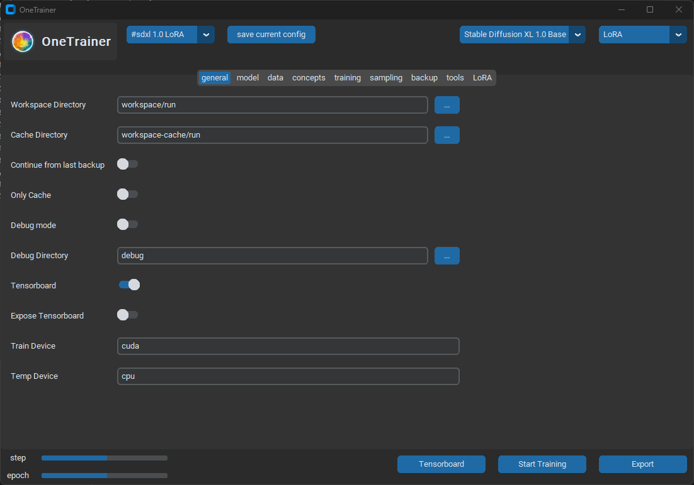

# OneTrainer

OneTrainer is a one-stop solution for all your stable diffusion training needs.

<a href="https://discord.gg/KwgcQd5scF"></a><br>

## Features

- **Supported models**: FLUX.1, Stable Diffusion 1.5, 2.0, 2.1, 3.0, 3.5, SDXL, Würstchen-v2, Stable Cascade,
  PixArt-Alpha, PixArt-Sigma and inpainting models
- **Model formats**: diffusers and ckpt models
- **Training methods**: Full fine-tuning, LoRA, embeddings
- **Masked Training**: Let the training focus on just certain parts of the samples.
- **Automatic backups**: Fully back up your training progress regularly during training. This includes all information
  to seamlessly continue training.
- **Image augmentation**: Apply random transforms such as rotation, brightness, contrast or saturation to each image
  sample to quickly create a more diverse dataset.
- **Tensorboard**: A simple tensorboard integration to track the training progress.
- **Multiple prompts per image**: Train the model on multiple different prompts per image sample.
- **Noise Scheduler Rescaling**: From the paper
  [Common Diffusion Noise Schedules and Sample Steps are Flawed](https://arxiv.org/abs/2305.08891)
- **EMA**: Train your own EMA model. Optionally keep EMA weights in CPU memory to reduce VRAM usage.
- **Aspect Ratio Bucketing**: Automatically train on multiple aspect ratios at a time. Just select the target
  resolutions, buckets are created automatically.
- **Multi Resolution Training**: Train multiple resolutions at the same time.
- **Dataset Tooling**: Automatically caption your dataset using BLIP, BLIP2 and WD-1.4, or create masks for masked
  training using ClipSeg or Rembg.
- **Model Tooling**: Convert between different model formats from a simple UI.
- **Sampling UI**: Sample the model during training without switching to a different application.
- **AlignProp**: A Reinforcement Learning method for diffusion networks from the paper
  [Aligning Text-to-Image Diffusion Models With Reward Backpropagation](https://arxiv.org/abs/2310.03739)



## Installation

Installing OneTrainer requires Python >=3.10 and <3.13. You can download Python
here https://www.python.org/downloads/windows/.
Then follow these steps:

Automatic installation

- Clone the repository `git clone https://github.com/Nerogar/OneTrainer.git`
- Run:
    - Windows: `install.bat`
    - Unix based systems: `install.sh`

Manual installation

- Clone the repository `git clone https://github.com/Nerogar/OneTrainer.git`
- Navigate into the cloned directory `cd OneTrainer`
- Set up a virtual environment `python -m venv venv`
- Activate the new venv:
    - Windows: `venv\scripts\activate`
    - Unix based systems: `source venv/bin/activate`
- Install the requirements `pip install -r requirements.txt`

In some linux distribution, you might need to install libGL, for instance on ubuntu you will need to run:
```
sudo apt-get update
sudo apt-get install libgl1
```

## Updating

Automatic update

- Run `update.bat` or `update.sh`

Manual update

- Pull changes `git pull`
- Activate the venv `venv\scripts\activate`
- Re-Install all requirements `pip install -r requirements.txt --force-reinstall`

## Usage

To start the UI, run `start-ui.bat`. [You can find a quick start guide here.](docs/QuickStartGuide.md), and a more
detailed overview of different topics [here](docs/Overview.md).

If you need more control, OneTrainer supports two modes of operation. Command line only, and a UI.
All commands need to be run inside the active venv created during installation.

All functionality is split into different scrips located in the `scripts` directory. This currently includes:

- `train.py` The central training script
- `train_ui.py` A UI for training
- `caption_ui.py` A UI for manual or automatic captioning and mask creation for masked training
- `convert_model_ui.py` A UI for model conversions
- `convert_model.py` A utility to convert between different model formats
- `sample.py` A utility to sample any model
- `create_train_files.py` A utility to create files needed when training only from the CLI
- `generate_captions.py` A utility to automatically create captions for your dataset
- `generate_masks.py` A utility to automatically create masks for your dataset
- `calculate_loss.py` A utility to calculate the training loss of every image in your dataset

To learn more about the different parameters, execute `<script-name> -h`. For example `python scripts\train.py -h`

If you are on Mac or Linux, read [the launch script documentation](LAUNCH-SCRIPTS.md) for detailed information about how
to run OneTrainer and its various scripts on your system.

## Contributing

Contributions are always welcome in any form. You can open issues, participate in discussions, or even open pull
requests for new or improved functionality. You can find more information [here](docs/Contributing.md).

Before you start looking at the code, I recommend reading about the project structure [here](docs/ProjectStructure.md).
For in depth discussions, you should consider joining the [Discord](https://discord.gg/KwgcQd5scF) server.

You also **NEED** to **install the required developer dependencies** for your current user and enable the Git commit
hooks, via the following commands (works on all platforms; Windows, Linux and Mac):

```sh
pip install -r requirements-dev.txt
pre-commit install
```

(Be sure to run those commands *without activating your venv or Conda environment,*
since [pre-commit](https://pre-commit.com/) is supposed to be installed outside any environment.)

Now all of your commits will automatically be verified for common errors and code style issues, so that code
reviewers can focus on the architecture of your changes without wasting time on style/formatting issues, thus
greatly improving the chances that your pull request will be accepted quickly and effortlessly.

## Related Projects

- **[MGDS](https://github.com/Nerogar/mgds)**: A custom dataset implementation for Pytorch that is built around the idea
  of a node based graph.
- **[StableTuner](https://github.com/devilismyfriend/StableTuner)**: Another training application for Stable Diffusion.
  OneTrainer takes a lot of inspiration from StableTuner and wouldn't exist without it.
- **[Visions of Chaos](https://softology.pro/voc.htm)**: A collection of machine learning tools that also includes
  OneTrainer.
